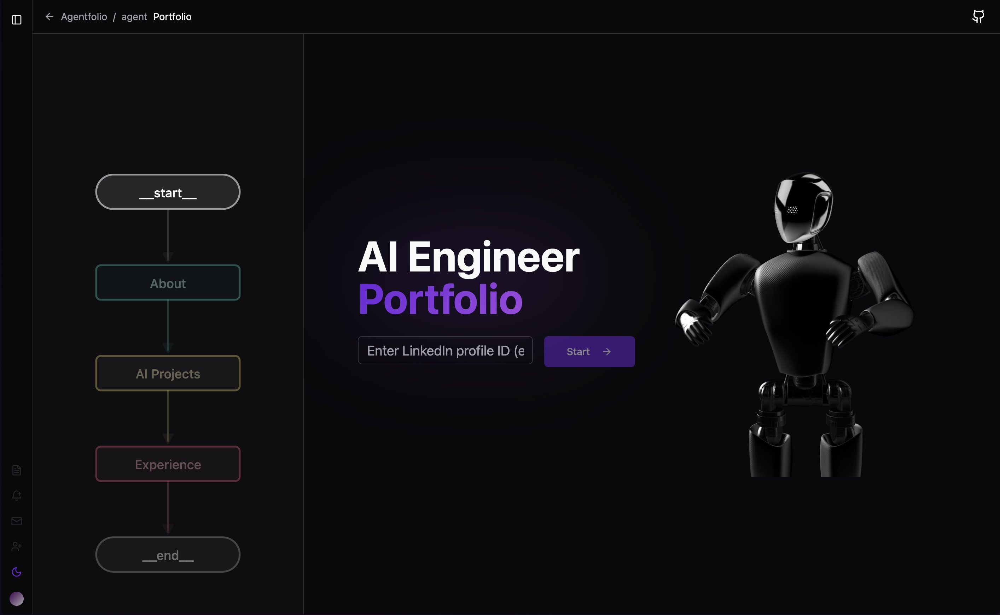
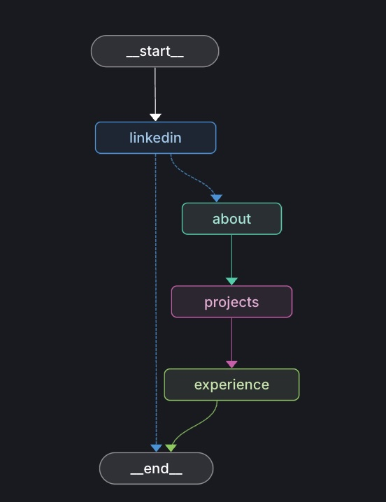
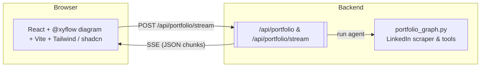

# Graph-Agent-Folio

> **Showcase your AI portfolio in seconds – scraped from LinkedIn, orchestrated by [LangGraph](https://www.langchain.com/langgraph), streamed live to a beautiful React UI.**

<p align="center"></p>

Graph-Agent-Folio turns a plain LinkedIn profile into an *interactive*, *streaming* portfolio site.  A LangGraph agent fetches your public profile data, enriches it with an LLM and streams JSON chunks to the browser so visitors can watch the site build itself in real-time.

---

## 🔭 Vision

1. **Zero-effort personal site** – drop your LinkedIn handle, get a fully-styled portfolio with About, Projects and Experience sections.
2. **Visually engaging** – a side panel renders the *actual* LangGraph workflow so users can see how the agent thinks.
3. **Live streaming UX** – content appears token-by-token; no loading spinners, only progressive disclosure.
4. **Hackable template** – fork and replace the LinkedIn tool with any data source to showcase *any* structured / unstructured content.

---

## 🧠 How it works

<p align="left"></p>

1. **linkedin_node** – fetch / load profile and decide if it exists.
2. **about_node** – summarise profile and emit `about_data`.
3. **projects_node** – GPT-4o extracts notable projects and emits `projects_data`.
4. **experience_node** – transforms positions into a tidy JSON structure.
5. **values** events – LangGraph emits cumulative state snapshots that are forwarded as *Server-Sent Events* (SSE) to the UI.

The full deep-dive lives in [`technical_overview.md`](technical_overview.md).

---

## 🖼️ High-level architecture



---

## ⚡ Quick start

### 1 – Production in one command

```bash
# Build *and* run the full stack (Docker + multi-stage build)
docker compose up --build
# FastAPI: http://localhost:8000  |  React bundle is served at /
```

### 2 – Local development (hot-reload)

```bash
# back-end
python -m venv .venv && source .venv/bin/activate
pip install -e backend[dev]
uvicorn backend.app.main:app --reload --port 8000

# front-end (new terminal)
cd frontend && npm install && npm run dev   # http://localhost:5173
```

### 3 – Inspect / debug the graph visually

```bash
langgraph dev   # http://localhost:2024
```

Add this proxy in `frontend/vite.config.ts` so the UI can call the API without CORS issues:

```ts
server: {
  proxy: {
    '/api': 'http://localhost:8000',
  },
},
```

---

## 📁 Repository layout

```text
backend/                FastAPI app + LangGraph agent
└─ app/
   ├─ main.py           FastAPI entry-point (serves API + static bundle)
   └─ agent/            LangGraph workflow & tools
frontend/               Vite / React / shadcn-ui
Dockerfile              Multi-stage build (React → FastAPI)
docker-compose.yml      Compose service for production / staging
langgraph.json          Graph spec for `langgraph dev`
```

---

## 🔐 Environment variables

Create a `.env` file at the repo root (loaded by both FastAPI and LangGraph):

```bash
OPENAI_API_KEY=sk-...

# Optional LangSmith tracing (highly recommended)
LANGSMITH_API_KEY=ls-...
LANGSMITH_TRACING=true

# LinkedIn scraping via ProAPIs (https://proapis.com/)
PROAPIS_KEY=pk-...
```

---

> _Built to demonstrate agentic applications with LangGraph & a modern React UI.  Fork away and build your own!_