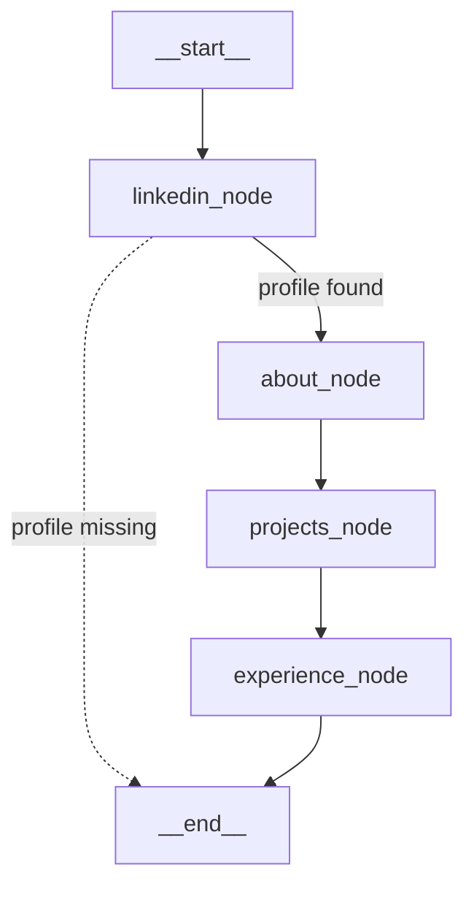

# Live-Streaming Portfolio – Technical Overview

*(last updated Aug-2025)*

This document captures the full stack that streams a LinkedIn-driven portfolio from a **LangGraph** agent (FastAPI backend) to a **React** frontend, including real-time workflow visualisation.

---

## 1. Backend – FastAPI + LangGraph

### 1.1 High-level Architecture

```
┌─────────────────────────────────────────┐
│  FastAPI                                │
│  /api/portfolio (POST)                  │→ synchronous JSON (legacy)
│  /api/portfolio/stream (POST)           │→ **SSE** stream
└─────────────────────────────────────────┘
            │
            ▼
┌─────────────────────────────────────────┐
│  LangGraph `portfolio_graph.py`         │
│  StateGraph<InputState, OutputState>    │
│   ├─ linkedin_node                       │ fetch & validate profile
│   ├─ about_node                          │ build about JSON & stream
│   ├─ projects_node                       │ GPT-4o extraction + stream
│   ├─ experience_node                     │ transform positions + stream
│   └─ conditional route (missing profile) │
└─────────────────────────────────────────┘
```

The backend owns two responsibilities:

1. **Running** the agent workflow.
2. **Translating** LangGraph events to [Server-Sent Events](https://html.spec.whatwg.org/multipage/server-sent-events.html) so the browser can consume them over a single HTTP response.

### 1.2 State & Events

#### InputState
```python
class InputState(TypedDict):
    linkedin_id: str
```

#### OutputState (subset)
```python
class OutputState(TypedDict):
    about_data: AboutSectionDict | None
    projects_data: ProjectsSectionDict | None
    experience_data: dict | None
    linkedin_status: Literal["found", "not_found"]
```

#### LangGraph event mapping

| LangGraph `event_type` | Forwarded as | Notes |
| ---------------------- | ------------ | ----- |
| `custom`  (`structured` chunk) | **custom** | progressive JSON for a node |
| `custom`  (`node_update`)      | **custom** | `{status:"started"|"completed"}` |
| `values`                       | **values** | cumulative `OutputState` snapshot |

`stream_state()` in `backend/app/agent/tools.py` walks any dict/list recursively and emits valid JSON after **every incremental mutation** – giving the illusion of fine-grained streaming.

### 1.3 Agent Flow (Mermaid)



---

## 2. Frontend – React + @xyflow

*(unchanged sections 2-7 – see previous revision)*

---

## 8. Deep-dive: Streaming Pipeline in the Hook

<table>
<tr><th>Stage</th><th>Description / Key Code</th></tr>
<tr><td>1. POST request</td><td>
<pre><code>fetch('/api/portfolio/stream', { 
  method: 'POST',
  headers: { 'Content-Type':'application/json',
             'Accept':'text/event-stream' },
  body: JSON.stringify({linkedin_id})
})</code></pre></td></tr>
<tr><td>2. ReadableStream loop</td><td>
`reader.read()` chunks decoded with `TextDecoder`.<br/>Buffer split on <code>/\n\n/</code> to isolate SSE records.</td></tr>
<tr><td>3. `handleSSE(msg)`</td><td>
<ul>
<li><b>node_update</b> → <code>setLoadingSection(section)</code></li>
<li><b>structured</b>  → <code>setState(prev =&gt; {...prev, section_data: deepMerge})</code></li>
<li><b>values</b>      → replace entire <code>state</code> (non-terminal)</li>
</ul></td></tr>
<tr><td>4. Stream close</td><td>
Hook sets <code>finished=true</code>, <code>streaming=false</code>, clears <code>loadingSection</code>.</td></tr>
</table>

### 8.1 Deep merge strategy

Because every structured chunk contains **only** the leaf that changed, we merge using a shallow spread by key (`{...prev, about_data: newPartial}`); our sections are small so a full recursive merge wasn’t necessary.

### 8.2 Why not EventSource?

`EventSource` only supports <code>GET</code>. We need <code>POST</code> to send the LinkedIn ID → used the `fetch+ReadableStream` pattern which works in every modern browser and Node runtime.

---

## 9. Future Enhancements

* **Reconnect / Resume** – store `threadId` or current state and resume streams.
* **Error Boundary** – wrap page routes to display neat fallback UI.
* **Optimistic Skeletons** – add ShadCN skeleton placeholders for smoother UX.
* **Graph editing** – drive `ReactFlow` from the same LangGraph JSON so the diagram is generated instead of hard-coded.

---

© 2025 Streaming Portfolio Demo
